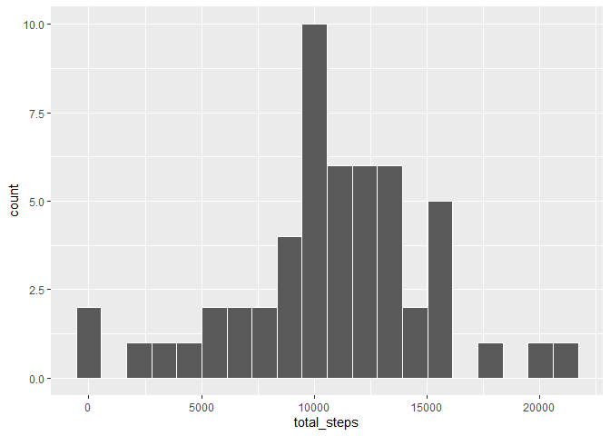
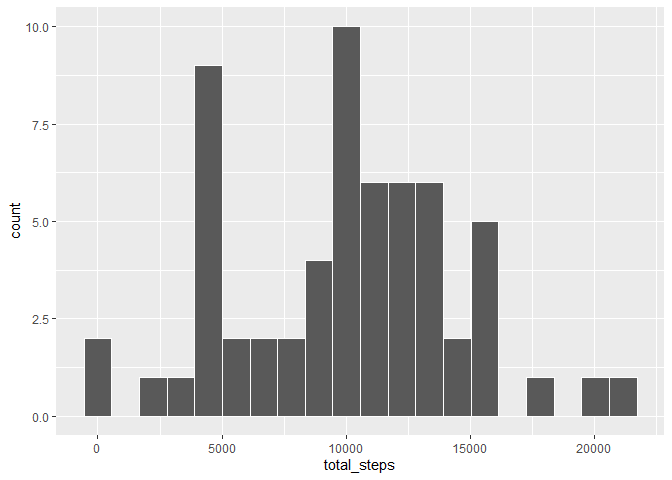
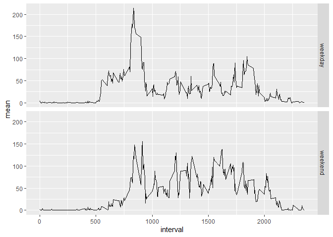

## Loading and preprocessing the data with the histogram


```r
actve <- read_csv('activity.zip')
actve_no_na <- actve[which(!is.na(actve[1])),]
prob1 <- actve_no_na |> group_by(date) |> 
    summarise(total_steps = sum(steps))
g <- prob1 |> ggplot(aes(total_steps))
g + geom_histogram(bins = 20,color = 'white')
```

<!-- -->

## What is mean total number of steps taken per day?


```r
prob2 <- actve_no_na |> group_by(date) |> 
    summarise(mean = mean(steps),
              median = median(steps))
prob2
```

```
## # A tibble: 53 × 3
##    date         mean median
##    <date>      <dbl>  <dbl>
##  1 2012-10-02  0.438      0
##  2 2012-10-03 39.4        0
##  3 2012-10-04 42.1        0
##  4 2012-10-05 46.2        0
##  5 2012-10-06 53.5        0
##  6 2012-10-07 38.2        0
##  7 2012-10-09 44.5        0
##  8 2012-10-10 34.4        0
##  9 2012-10-11 35.8        0
## 10 2012-10-12 60.4        0
## # ℹ 43 more rows
```

## What is the average daily activity pattern?


```r
prob3 <- actve |> group_by(interval) |> 
    summarise(mean = mean(steps,na.rm = TRUE))
g <- prob3 |> ggplot(aes(interval,mean))
g + geom_line()
```

<!-- -->

```r
max <- prob3[which.max(prob3$mean),1]
```

The 5-minute interval that, on average, contains the maximum number of steps is
**835**

## Imputing missing values with the Histogram of the total number of steps taken each day after missing values are imputed

I have used the impute package's **impute.knn** function to fill in the missing values  
with the 3 nearest neighbors 


```r
totalNA <- sum(is.na(actve$steps))
```
total number of missing values in the dataset is 
**2304**


```r
library(impute)
prob4 <- actve[-2]
prob4 <- impute.knn(as.matrix(prob4),k = 3)$data
prob4 <- tibble(steps = prob4[,1],
                interval = prob4[,2],date=actve$date)
prob5 <- prob4 |> group_by(date) |> 
    summarise(total_steps = sum(steps))
g <- prob5 |> ggplot(aes(total_steps))
g + geom_histogram(bins = 20,color = 'white')
```

<!-- -->


```r
prob6 <- prob4 |> group_by(date) |> 
    summarise(mean = mean(steps),
              median = median(steps))
prob6
```

```
## # A tibble: 61 × 3
##    date         mean median
##    <date>      <dbl>  <dbl>
##  1 2012-10-01 15.5        0
##  2 2012-10-02  0.438      0
##  3 2012-10-03 39.4        0
##  4 2012-10-04 42.1        0
##  5 2012-10-05 46.2        0
##  6 2012-10-06 53.5        0
##  7 2012-10-07 38.2        0
##  8 2012-10-08 15.5        0
##  9 2012-10-09 44.5        0
## 10 2012-10-10 34.4        0
## # ℹ 51 more rows
```

## Are there differences in activity patterns between weekdays and weekends?


```r
prob7 <- prob4 %>% 
    mutate(diff = factor(ifelse(
        wday(prob4$date)>1&
            wday(prob4$date)<7,1,2),
        labels = c('weekday','weekend')))
prob7 <- prob7 |> group_by(interval,diff) |> 
    summarise(mean = mean(steps,na.rm = TRUE))
g <- prob7 |> ggplot(aes(interval,mean))
g + geom_line() + facet_grid(diff~.)
```

<!-- -->
           
Yes the main difference observed was that some dates which had all missing values appeared in the histogram plot.


